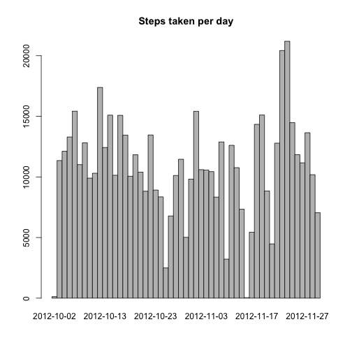
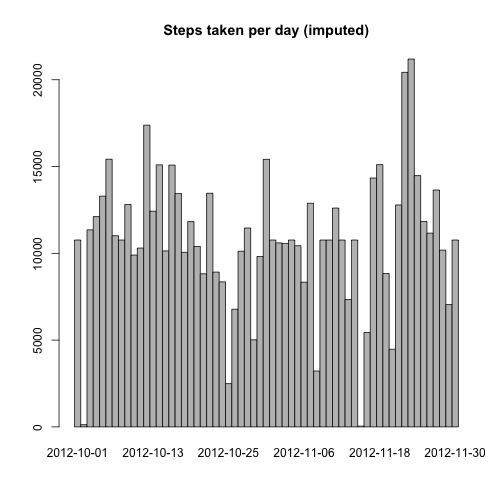
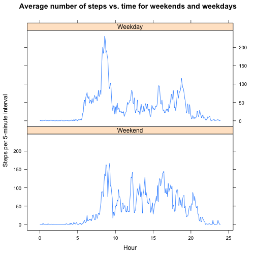

# Reproducible Research: Peer Assessment 1
==========================================

Set the working directory to the Reproducible Research folder.


```r
setwd("~/Documents/GitHub/Data Science Specialization/5) Reproducible Research/Peer Assessment 1")
```

## Loading and preprocessing the data

1.. Load the data: read the data from the .csv file and save it as 'stepsdata'.


```r
stepsdata <- read.csv('activity.csv')
```

2.. Process/transform the data (if necessary) into a format suitable for your analysis.


```r
stepsdata$hour <- floor(stepsdata$interval / 100)
stepsdata$min <- stepsdata$interval %% 100
stepsdata$time <- stepsdata$hour + stepsdata$min/60
```

## What is mean total number of steps taken per day?

1.. Make a histogram of the total number of steps taken each day.


```r
steps_by_day <- aggregate(steps ~ date, sum, data = stepsdata)
barplot(steps_by_day$steps, main="Steps taken per day",names.arg=steps_by_day$date,space=0)
```

 

2.. Calculate and report the mean and median total number of steps taken per day.


```r
meansteps = mean(steps_by_day$steps)
mediansteps = median(steps_by_day$steps)
```

The mean number of steps taken per day is 1.0766 &times; 10<sup>4</sup>. The median number of steps taken per day is 10765.

## What is the average daily activity pattern?

1.. Make a time series plot (i.e. `type = "l"`) of the 5-minute interval (x-axis) and the average number of steps taken, averaged across all days (y-axis)


```r
library(plyr)
dailyactivity <- ddply(stepsdata,~interval,summarise,mean=mean(steps,na.rm=TRUE))
dailyactivity$time <- floor(dailyactivity$interval/100) + (dailyactivity$interval %% 100)/60
plot(dailyactivity$time,dailyactivity$mean,type="l",xlab="hour",ylab="steps taken",main="Steps taken per 5-minute interval")
```

 

2.. Which 5-minute interval, on average across all the days in the dataset, contains the maximum number of steps?


```r
maxsteps <- dailyactivity$interval[which.max(dailyactivity$mean)]
maxstepsh <- floor(maxsteps/100)
maxstepsm <- maxsteps %% 100
```

The 5-minute interval, averaged over all days, containing the most steps is the time interval starting at 8:35.

## Imputing missing values

Note that there are a number of days/intervals where there are missing values (coded as NA). The presence of missing days may introduce bias into some calculations or summaries of the data.

1.. Calculate and report the total number of missing values in the dataset (i.e. the total number of rows with NAs)


```r
rowswithna <- nrow(stepsdata) - sum(complete.cases(stepsdata))
```

There are 2304 rows with NA's.

2.. Devise a strategy for filling in all of the missing values in the dataset. The strategy does not need to be sophisticated. For example, you could use the mean/median for that day, or the mean for that 5-minute interval, etc.

Let's impute with the average number of steps at that time interval for all days.

3.. Create a new dataset that is equal to the original dataset but with the missing data filled in.


```r
stepsdataimp <- stepsdata
for (i in 1:nrow(stepsdataimp)) {
  if (is.na(stepsdataimp$steps[i])) {
    stepsdataimp$steps[i] <- dailyactivity$mean[dailyactivity$interval == stepsdataimp$interval[i]]
  }
}
```

4.. Make a histogram of the total number of steps taken each day and Calculate and report the mean and median total number of steps taken per day. Do these values differ from the estimates from the first part of the assignment? What is the impact of imputing missing data on the estimates of the total daily number of steps?


```r
steps_by_day_imp <- aggregate(steps ~ date, sum, data = stepsdataimp)
barplot(steps_by_day_imp$steps, main="Steps taken per day (imputed)",names.arg=steps_by_day_imp$date,space=0)
```

 

```r
meanstepsimp = mean(steps_by_day_imp$steps)
medianstepsimp = median(steps_by_day_imp$steps)
```

The mean number of steps taken per day when using imputed data is 1.0766 &times; 10<sup>4</sup>. The median number of steps taken per day in that case is 1.0766 &times; 10<sup>4</sup>.

## Are there differences in activity patterns between weekdays and weekends?

For this part the weekdays() function may be of some help here. Use the dataset with the filled-in missing values for this part.

1.. Create a new factor variable in the dataset with two levels – “weekday” and “weekend” indicating whether a given date is a weekday or weekend day.


```r
stepsdataimp$weekday = as.factor(!(weekdays(as.Date(stepsdataimp$date)) == "Saturday" | weekdays(as.Date(stepsdataimp$date)) == "Sunday"))
levels(stepsdataimp$weekday) <- c("Weekend","Weekday")
```

2.. Make a panel plot containing a time series plot (i.e. type = "l") of the 5-minute interval (x-axis) and the average number of steps taken, averaged across all weekday days or weekend days (y-axis). The plot should look something like the following, which was creating using simulated data:


```r
dailyactivity <- ddply(stepsdataimp,~interval+weekday,summarise,mean=mean(steps,na.rm=TRUE))
dailyactivity$time <- floor(dailyactivity$interval/100) + (dailyactivity$interval %% 100)/60
library(lattice)
xyplot(mean ~ time|weekday, data = dailyactivity, type="l",layout=c(1,2), xlab="Hour",ylab="Steps per 5-minute interval",main="Average number of steps vs. time for weekends and weekdays")
```

 
